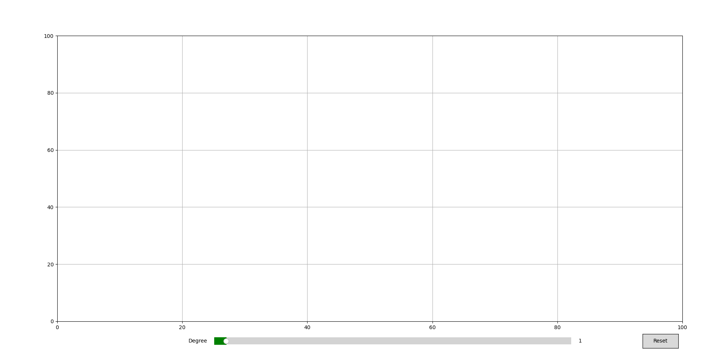
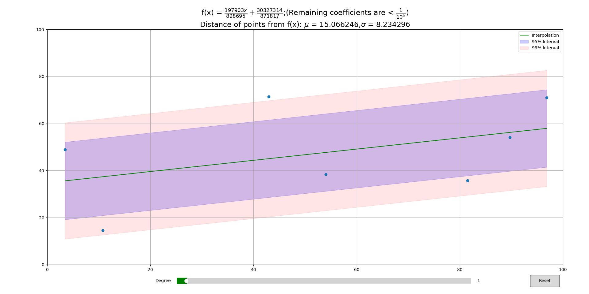
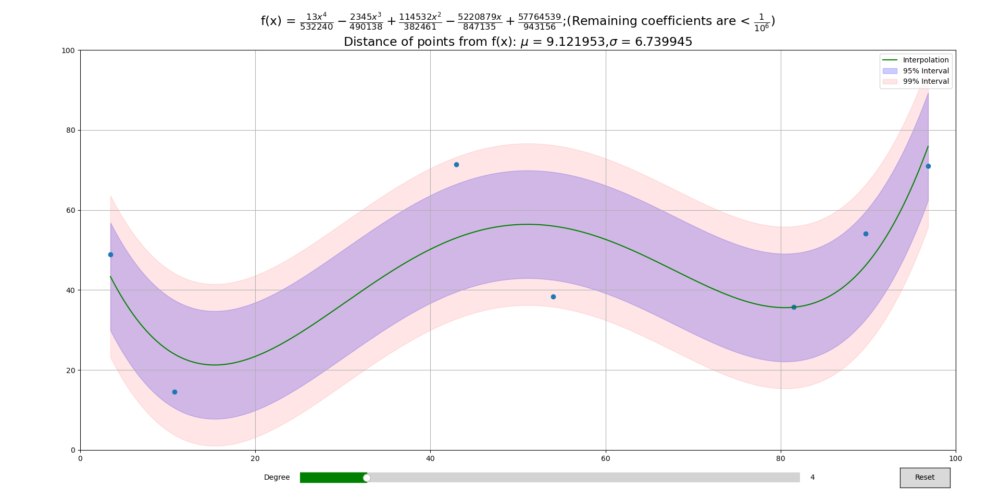
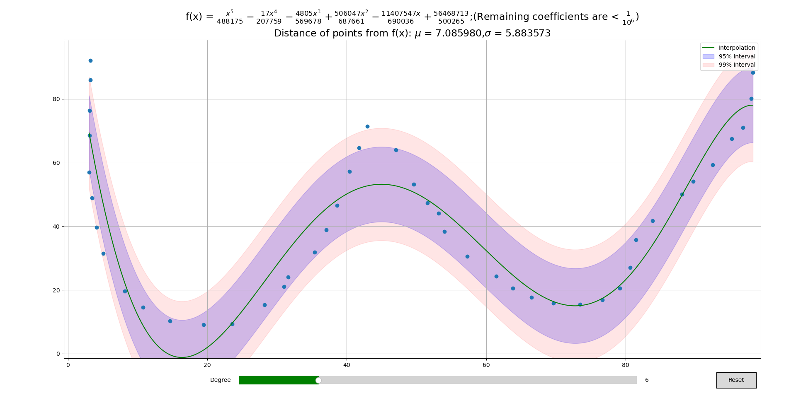
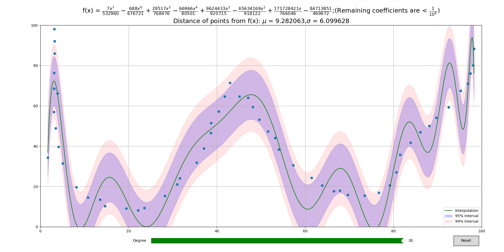

<div align="center"><h1>Polynomial Regression</h1> </div>

<div align="center"><h3>An interactive matlplotlib plot for polynomial regression</h3> </div>

<br>

<h2>Installation</h2>

```bash
git clone https://github.com/CodePleaseRun/polynomial-regression.git
cd polynomial-regression
```

**Dependencies:**

- `matplotlib`
- `numpy`
- `sympy`

<br>
<h2>Usage</h2>

```python
python main.py
```

<p align='center'>OR</p>

```python
python main.py points
```

where `points` is the file containing data points to be interpolated

```
.95,2.01
2.10,3.89
2.98,9.15
4.01,15.92
5.11,25.2
5.88,35.94
7.06,48.85
7.97,64.18
9.12,81.03
10.08,99.93
```

<br>

- Program will begin with a blank plot (unless data points are imported from `points`)
  

<br>

- Double clicking anywhere in the axes will plot the point
  and will update the curve accordingly
  

<br>

- Slider can be used to change the degree of the fitting curve (0 to 30)
  

<br>

- More points can be added by double clicking anywhere. The curve will update automatically.
  
  <br>
  <br>
  

<br>

- Reset button can be used to delete all the plots and start fresh

<br>

<h2>Licence</h2>
 <h3>MIT</h3>
